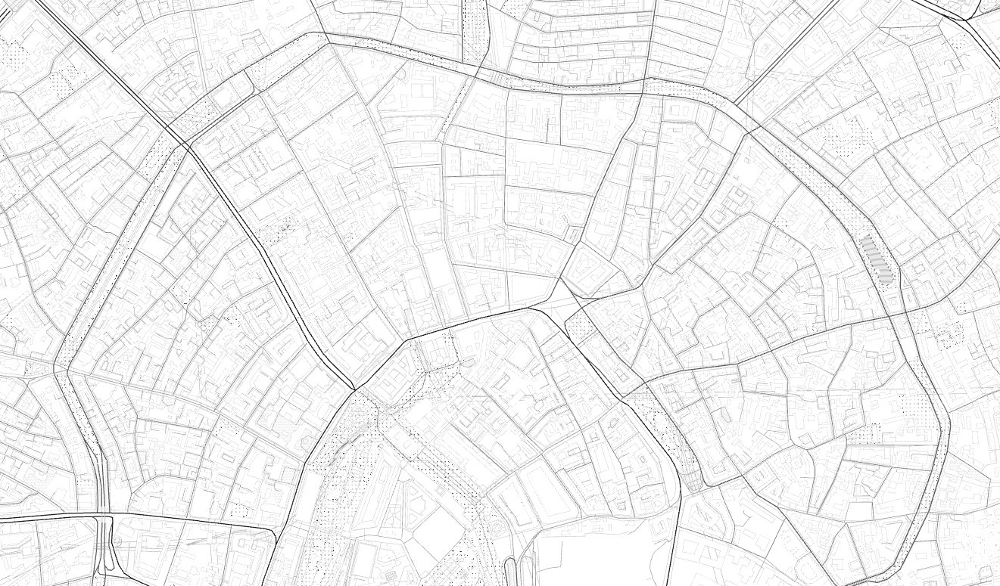

# mapzen-slippy-map



Mapzen maps. In a browser. Full-screen. With the ability to screenshot themselves.

## Caveats

This doesn't do a _bunch_ of things that any normal map does, yet.

## Usage

### Basic

Put it on a web server. Or: Use the handy `slippy` target in the included Makefile.

Like this:

```
make slippy
```

This will start a small [local web server](www-server) that you can visit in your web browser by going to `https://localhost:8080`

If you don't know what a "Makefile" is or don't make the `make` program installed on your computer you can start `mapzen-slippy-map` by hand, from the command-line, like this:

```
./utils/PLATFORM/www-server -path ./www -tls
```

Where `PLATFORM` should be one of the following:

* darwin (as in Mac OS X)
* linux
* windows

_By default the local web server will create a self-signed TLS certificate and key pair. Because they are self-signed this will cause your web browser to complain about not knowing who actually signed the TLS certificate. This is the correct behaviour (for a web browser). If you don't want or need this functionality then you should remove the `-tls` flag when invoking the web server. It is not at all clear that enabling TLS by default is the correct approach and this may change in the future._

### Advanced

It is also possible to proxy (and cache) tiles from Mapzen, assuming you are using the [local web server](www-server). Like this:

```
make proxy
```

Like the `slippy` Makefile target this is just a convenience for a bunch of typing you can and may want to do by hand.

There's actually a bunch of things going on so it's worth describing them. The first thing the `proxy` target does is invoke the `slippy` target passing along a `PROXY=1` argument: 

```
/usr/bin/make slippy PROXY=1
if test ! -e www/javascript/slippy.map.config.js; then cp www/javascript/slippy.map.config.js.example www/javascript/slippy.map.config.js; fi
if test ! -e utils/darwin/www-server; then echo "missing build for darwin"; exit 1; fi
if test -z "$PROXY"; then utils/darwin/www-server -path www -tls; exit 0; fi
```

Since the `PROXY` argument the Make program continues along ensuring that there are both a folder to cache proxied tiles in and a config file for how to manage tile proxying:

```
if test ! -d tiles/cache; then mkdir -p tiles/cache; fi
if test ! -e tiles/config.json; then cp tiles/config.json.example tiles/config.json; fi
```

_As of this writing the functionality and documentation around the [tile proxying](https://github.com/thisisaaronland/go-slippy-tiles) is still a work in progress so the easiest thing is to not try changing any of the details in the config file._

Next we make sure that the Javascript configuration files enable tile proxying. This is necessary because the local web server is just a dumb file server (with the ability to proxy tiles) and not an application server with any kind of complex interactions with the Javascript code.

```
perl -p -i -e "s/var\s+_proxy\s+=\s+false;/var _proxy = true;/" www/javascript/slippy.map.config.js
```

Finally we start the web server with flags to enable tile proxing that you can visit in your web browser by going to `https://localhost:8080`.

```
utils/darwin/www-server -path www -tls -proxy -proxy-config tiles/config.json
start and listen for requests at https://localhost:8080
```

_Note the self-signed TLS stuff discussed above._

## Keyboard controls

## WASD

`slippy-map` supports the [WASD key configuration](https://en.wikipedia.org/wiki/Arrow_keys#WASD_keys) for panning the map. `W` will move the map upwards, `S` downwards. `A` will move the map to the left and `D` to the right.

_The standard keyboard arrow keys are also supported and pan the map in a direction corresponding the key being pressed._

## Shift-B

Load the `bubble-wrap` style.

## Shift-C

Load the `cinnabar` style.

## Shift-L

Toggles between labeled and unlabeled versions of the current style. _This is still a bit clunky and does not apply to the `bubble-wrap` or the `outdoor` styles._

## Shift-O

Load the `outdoor` style.

## Shift-R

Load the `refill` style.

## Shift-Z

Load the `zinc` style.

## Screenshots

## Shift-S

This will create a screenshot of the current map view and open it up in another browser tab.

## Ctrl-Shift-S

This will create a screenshot of the current map view and try to save it to the place your browser saves downloads. Filenames are generated as follows:

"slippy-map-" + `MAP STYLE` + "-" + `YEARMONTHDAY` + "-" `GEOHASH(SW lat,lon)` + "-" + `GEOHASH(NE lat,lon)` + ".png"

## Updating the map styles

Run the handy `make mapzen` target in the included Makefile to update all map styles (and their assets) from source.

## Things that `mapzen-slippy-map` still needs to learn how to do

* Search
* Geolocation
* Maybe GetLatLon style coordinate display? 
* Screenshot controls for touch devices

## See also

* https://github.com/tangrams/


